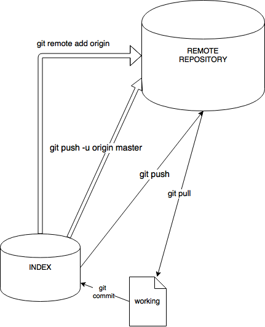

# git4ops - een git training voor "Operations"


## wat is git
git is een tool die je code tegen jezelf en tegen anderen beschermt. Je kunt je code vrijuit veranderen, stukmaken, verbeteren, wat je maar wilt, maar je kunt altijd weer terug omdat git steeds tussentijds elke toestand opslaat. Met git kun je zonder zorgen met meerdere mensen tegelijk aan code werken. Maar het helpt je ook als je in je eentje werkt! Het is een vangnet tegen vergissingen, daardoor ga je makkelijker mooie dingen proberen: het kan toch geen kwaad, tot je het publiceert.

Git beschermt je tegen chaos door je creatieproces in veilige stappen te verdelen. Elke stap krijgt een label dat uniek is over de hele codebase heen.

## install

*   git for windows => download van https://git-scm.com/download/win, let even op de juiste 32/64 bits versie voor jouw systeem. Hieronder een paar wel handige setup keuzes, maar doe vooral wat je zelf prettig vindt.


Er zijn ook diverse GUI tools, maar het is vaak beter om het via de commandline te leren, we komen later nog even op die GUI tools terug.

Na installatie moet je jezelf bekend maken als user.

>VOER UIT:

```
$ git config --global user.name "jouw naam"
$ git config --global user.email jouwnaam@umcg.nl
```
> voer deze commando's uit in je eigen omgeving. Gebruik je UMCG email adres, dan kun je straks vanzelf bij de echte omgeving.

Met git config kun je nog veel meer dingen regelen, zoals allerlei default gedrag, je standaard editor, je diff tool etc. Dat laten we nu even voor wat het is.
   
## de repository: init en clone
### een nieuwe repo aanmaken: init
Git organiseert alles van een product/project in een "repository". Je kunt een nieuwe aanmaken, of meegaan op een al bestaande voor dat product.
Laten we een nieuwe aanmaken: git init (van "initialize")
>Voer uit:

`git init myfirstrepo`

> maakt een directory 'myfirstrepo' aan en maakt daar een git repo van 

Of:

`
git init 
`
> dit maakt van je **current directory** een git repository
 

### een bestaande repo gebruiken: clone
Als er al een repository bestaat voor dit product kun je er mee gaan werken door `git clone username@host:repo`
Je krijgt dan de hele inhoud van de repo naar je toegestuurd, inclusief alle status en historie. 

>VOER UIT:

`git clone https://github.com/git4opsumcg/git4opstraining`

@@@TODO@@@ AANMAKEN en voeg een README.txt toe /@@@TODO@@@

Je hebt nu een kopie van de repo lokaal staan: je kunt aan het werk.


## hoe staan we er voor: status
Je kunt nu files aanmaken op je lokale repo directory. Met `git status` kun je kijken in welke toestand die files zich bevinden. Kent git de file al of niet, heb je iets veranderd waar git nog niet van weet etc. 
> VOER UIT:

`git status`

Je ziet nu:

```
On branch master
nothing to commit, working directory clean
```
Wat staat er in:  (dir of ls)

```
/dev/work/git4opstraining(master)$ ls
README.txt
```

Maak nu een file aan met iets er in.  
>VOER UIT:

`echo 'Hello world!' >> hithere_your-name.txt` (dus met jouw naam ingevuld)

Nog een keer ` git status `   en je ziet:

``` On branch master
Untracked files:
  (use "git add <file>..." to include in what will be committed)

	hithere_your-name.txt

nothing added to commit but untracked files present (use "git add" to track)

```
De uitleg spreekt voor zich: we zien een file in de repo directory staan die git nog niet kent. Verder een aantal tips voor wat je nu kunt doen. 

## uitleg: de staging area
Even een uitstapje naar wat er nu gebeurt. (whiteboard)

bouwen, testen, klaarzetten en tussenstand bewaren, cyclus, samenhangend brokje af: publiceren.


## klaarzetten: add
We willen niet alleen die file toevoegen, we willen ook iets aan de README.txt veranderen. 
>VOER UIT:

Voeg een willekeurige tekst toe aan de README.txt

`git status`

Goed, we zijn even tevreden met wat we gedaan hebben en willen een tussenstand bewaren. Nu hebben we twee heel verschillende dingen gedaan, en dat willen we eigenlijk onthouden. Dus gaan we die twee dingen apart als actie in de tussenstand zetten.

>VOER UIT:

`git add hithere_your-name.txt`

Wat je daarmee doet is: "ik voeg aan de tussenstand-bewaar-actie dit bestand toe, want die hoort bij de verandering die ik gedaan heb". Die README.txt actie deed je om een heel andere reden, dus die doen we straks. 

## tussenstand bewaren: commit en commitmessage
Je hebt nu klaargezet wat je wilt bewaren, dus daar gaan we dan:

>VOER UIT:

`git commit -m "Adds hello world message"`

Met git commit stuur je het setje changes dat je met git add had toegevoegd naar de staging area (zie plaatje). 
> Een correcte commit message (`-m "commit message"` ) is echt SU-PERbelangrijk. Je kunt daarmee, samen met het selectieve klaarzetten voor commit (`git add`), later in de log precies terugzien wat de reden was van deze verandering en welke files daarvoor geraakt zijn. Iets waar je heel blij mee zult zijn zodra je het nodig hebt. En je gaat het nodig hebben :-)

</br>
> VOER UIT:

`git status`

O ja, we waren nog niet klaar, we hadden nog iets veranderd. 
>VOER UIT:

```
git commit -a -m "adds remark to the README for educational purposes"
git status
```

>De -a flag voegt in één klap alle nog openstaande wijzigingen toe aan de commit. 
>Wees daar voorzichtig mee, maar het is wel heel handig als je een heleboel files hebt geraakt (en verwijderd) voor één logische wijziging, dan hoef je ze niet allemaal per stuk toe te voegen, waardoor je minder makkelijk eentje vergeet. 

>Het is conventie om code comments en git commit comments in het Engels te schrijven, zodat iedereen later kan lezen wat er aan de hand is. Als je het heel netjes wilt doen (en dat willen we) dan schrijf je in de derde persoon: [this change] "adds remark to" of als imperatief "add remark to" etc. Je ziet beide in de praktijk. Kies als team één stijl.

Je ziet dat alles nu "schoon" is: de huidige status van je werkdirectory is gelijk aan de staging area. 

>VOER UIT:<br/>
>maak een aantal wijzigingen in je omgeving. Voeg files toe, edit wat in die files. Vervang een woord, wissel woorden om etc. Add en commit steeds tussendoor met een **betekenisvolle** commitmessage, zodat je straks een setje commits hebt om doorheen te bladeren. 

## wat is er allemaal gebeurd: git log
>VOER UIT:

`git log`

Je ziet nu al je commits langskomen. `git log` heeft een heel rijke syntax waarmee je de meest uitgebreide manieren krijgt om de historie te bekijken. 

In de output zie je de naam van de commit ("hash"), de auteur, datum en tijd, en de (eerste regel van de) commit message. Die info is belangrijk voor het geval dat je vergissingen wilt herstellen. Je kunt dan met de naam van de commit precies de staat van de codebase aanwijzen op een bepaald moment. Al deze "vlaggetjes" worden gedeeld met iedereen die aan de codebase werkt.


>VOER UIT:

`git help log`

Je ziet, heel veel opties om de log vorm te geven.
Probeer een paar log opties, bijvoorbeeld `git log --oneline --decorate` of 
`git log --pretty=format:"%h %ar [%an] - %s"`


## wat is er veranderd in een commit: git diff
>VOER UIT:

```
git status	
git log
```

Als je nog uncommitted changes hebt: `git diff` om de verschillen met de huidige kop van de index te zien.

Anders:
Kijk naar de output van `git log`
Kies een commit uit. Voer uit `git diff [commit-hash]`
>Je hoeft niet de hele hash in te kloppen, de eerste 7 tekens zijn al uniek genoeg

Wat je ziet is het verschil van je huidige staat met de gekozen commit. Je kunt ook twee commits met elkaar vergelijken `git diff [hash1] [hash2]`

Ook bij `diff`: veel opties. Default laat diff van vrij grote blokken de verschillen zien, dat is niet per se overzichtelijk. Met `diff -w` negeer je whitespace (pas op met python scripts! :-)) en met `diff --word-diff` toon je de verschillen binnen het tekstblok. Probeer maar

>Voer uit:
>
`git diff -w --word-diff [commit2] [commit1]`

Speel wat met andere diff opties.


## kies welke versie je wilt bekijken: git checkout
Als je de hele log reeks bekijkt zie je dat elke verandering die is gecommit aangeduid is met een hash. Je kunt elk van die hashes uitchecken en naar je working directory halen. 

`git checkout [hash]`

je krijgt de codebase dan precies in de toestand waarin hij toen was. Het is een heel geruststellend idee dat je altijd naar een bekende staat terug kunt. 

De toestand die je op zeker moment hebt uitgecheckt heeft een logische naam: "HEAD". 


## alleen voor jezelf of ook voor anderen: git remote
UITLEG: Whiteboard!
remote, origin, master



Let op: "origin" is alleen maar de default naam, je mag helemaal zelf weten hoe je die remote repo zelf wilt refereren. Het is wel handig daar iets over af te spreken, want als je met een collega pairt of iemand komt je even helpen dan is het niet praktisch als iedereen een andere naam bedenkt voor een bepaalde remote repo ref.

## publiceren: push
Als je een aantal commits hebt verzameld die samen een logisch samenhangend brokje functionaliteit vormen dan kun je publiceren wat je hebt gemaakt. Hoe groot dat brokje is hangt van de context af, bij een bugfix is het soms maar één character :-) In het algemeen is de richtlijn: mik op KLEINE brokjes, oftewel: wacht niet te lang met publiceren. Hoe eerder de integratie, hoe kleiner de kans op uit elkaar lopen van versies.

Git beschermt de repo tegen het blindelings opsturen van een toestand die niet is gemerged.

>Voer uit:

`git push`

je ziet iets als:

```
To https://github.com/LuukDijkhuis/git4ops.git
 ! [rejected]        master -> master (fetch first)
error: failed to push some refs to 'https://github.com/LuukDijkhuis/git4ops.git'
hint: Updates were rejected because the remote contains work that you do
hint: not have locally. This is usually caused by another repository pushing
hint: to the same ref. You may want to first integrate the remote changes
hint: (e.g., 'git pull ...') before pushing again.
hint: See the 'Note about fast-forwards' in 'git push --help' for details.
```

Je moet nu eerst zorgen dat de staat van jouw local repo overeenkomt met die van de remote repo plus jouw wijzigingen. Dan kun je het geheel weer een stapje verder brengen en dat publiceren. 

## werk van anderen ophalen: fetch, merge, pull
Vóór je gaat publiceren naar remote haal je dus eerst de huidige stand van zaken op. 
Het kan immers zijn dat anderen wijzigingen hebben aangebracht in files waar jij ook net mee bezig was. 

Als die veranderingen op andere plekken in het bestand zitten dan worden die veranderingen in elkaar geschoven: dat heet een "merge". 
De bijbehorende (automatische) tests en documentatie worden natuurlijk ook mee ge-update dus als je na het in elkaar schuiven van de nieuwe situatie je tests weer runt zou alles weer/nog moeten werken. 
Mochten die wijzigingen elkaar negatief beïnvloeden dan heb je nu tijd om dat na te gaan en lokaal te repareren.


>Voer uit:

`git fetch`
Dit haalt de wijzigingen op van de remote repository, maar voert nog geen merge uit.  
Dat maakt het mogelijk om van tevoren te kijken wat de wijzigingen zijn voor je gaat mergen. 

`git merge` 
Voert de wijzigingen uit op je working set.

`git pull`
Doet `git fetch` en `git merge` na elkaar, en nog wat magic eromheen. 

Meestal zal `git pull` best okee werken, maar soms, bij complexe wijzigingen, willen er nog wel eens allerlei onhandige conflictsituaties optreden. Zie later. In die gevallen is het praktisch om eerst te fetchen, te inspecteren, mogelijk aan te passen en dan te mergen. We komen over dit alles nog te spreken in het onderwerp "branch"


## uitleg: verschillende wijzigingen in dezelfde file
Stel je hebt deze file, genaamd `hithere.txt`:

```
@echo off
echo "hello World"
```
en je wilt graag iets anders groeten

```
@echo off
echo "hello Mars" 
```

maar je collega elders verandert het in

```
@echo off
echo "hello Venus"
```

Je draait allebei de aangepaste test, je bent allebei tevreden, add, commit -m en na een tijdje "push". De eerste merkt niks, dat gaat prima, dus origin/master bevat nu "hello Mars". De tweede wil pushen, maar krijgt die melding van zonet: rejected, fetch first. Okee dan, `git pull` en dan gebeurt er iets nieuws: 

```
[blabla]
21269ea..759f990  master     -> origin/master
Auto-merging hithere.txt
CONFLICT (content): Merge conflict in hithere.txt
Automatic merge failed; fix conflicts and then commit the result.
```

Wat je nu in de file ziet is het volgende:

```
@echo off
<<<<<<< HEAD
echo "hello Venus"
=======
echo "hello Mars"

>>>>>>> 759f990bdac88dac668a6fce10085e43ab98f301
```

Merk op dat beide varianten in deze samengestelde file staan. De ene `<<<<<<< HEAD` is jouw lokale variant, de andere `>>>>>>> 759f990bdac88dac668a6fce10085e43ab98f301` is die van origin/master. Je ziet dat de merge aangeeft dat je van hash 21269ea naar 759f990 gaat, en dat de getoonde hash bij >>>>>> die laatste is. Nu kun je zelf de nieuwe variant maken.

```
@echo off
echo "hello Mars and Venus"
```

en die inchecken. 

```
(update tests)
git add hithere.txt
(run tests)
git commit -m "resolve merge conflict"
git push
```

Als je collega nu `git pull` doet dan krijgt hij de resolved versie binnen. Zonder conflict want git ziet dat we weer een stapje verder zijn.


## een stukje ontwikkeling tijdelijk isoleren: branch
UITLEG:
Branch, local en remote.

>Voer uit:

```
git branch mijnbranch
```
Je hebt nu een Branch aangemaakt genaamd "mijnbranch", maar **je zit er nog niet op**. Als je nu een wijziging doet komt die op de trunk! Om je HEAD naar de Branch te zetten doe je:

>Voer uit:

`git checkout mijnbranch`

**Nu** zit je er op. Als je een wijziging doet (*) dan komt die dus op de branch.

```
       		   - [mijnbranch]         -*- [mijnbranch]
              /                      /
[trunk] --*--+--*-   versus    --*--+ [trunk]
```

Of als shortcut `git checkout -b mijnbranch` (in één keer aanmaken en erop gaan)

Tip: <http://learngitbranching.js.org>, erg coole oefeningen in branchen en andere git acties.

>Voer uit: je zit nu op "mijnbranch". Maak een wijziging in hithere_jouwnaam.txt, en commit de wijziging. `git checkout master` brengt je weer terug naar de trunk. `cat hithere_jouwnaam.txt` en je ziet dat je wijziging hier niet staat. `git checkout mijnbranch` en `cat hithere_jouwnaam.txt` en ja hoor daar is je wijziging weer.

Waarom zou je willen branchen? Bijvoorbeeld omdat je grote wijzigingen aan het maken bent in versie PRODUCTIE + n en je moet een verandering doen op versie PRODUCTIE. Check dan PRODUCTIE uit, maak een branch, schrijf een test, doe de wijziging, test hem en je hebt een geïsoleerde aanpassing op de productie versie. Zorg daarna dat je de aanpassing ook terugbrengt naar de Trunk.

Je kunt ook een branch maken als je juist een hele grote change gaat doen waar je niet iedereen mee lastig wilt vallen. Pas als het werkt merge je het dan in de trunk. Dat heeft ook zo zijn nadelen. Maar branching en merging strategie is een apart en uitgebreid onderwerp waar we het nu niet over gaan hebben.


## wijzigingen op een branch naar de trunk halen: merge
Een branch maak je om iets tijdelijk te isoleren. Maar je hebt maar één codebase, dus die wijziging wil je meestal terugmergen in de trunk. 
>Voer uit:

```
git checkout master
git merge mijnbranch
```
>je ziet wat opmerkingen:

```
Updating 8705699..3b2388c
Fast-forward
 hithere_jouwnaam.txt | 1 +
 1 file changed, 1 insertion(+)
```

Bekijk `hithere_jouwnaam.txt` en je ziet dat de change zit nu ook in de trunk zit.

Let op: je gaat naar de branche waar je het in wilt hebben, en merget daar NAARTOE! 
Als je branch lang leeft dan is het nodig om met grote regelmaat de wijzigingen die op de trunk plaatsvinden in te mergen, anders loop je al snel zodanig uit de pas dat het stikt van de merge conflicts. Not cool. 

Dus: SHORTLIVED BRANCHES of VAAK DE TRUNK IN-MERGEN!


## een speciale versie een naampje geven: tag
We hadden het net over "PRODUCTIE" en "PRODUCTIE + n" dat was in abstracto bedoeld. Maar je kunt een hash daadwerkelijk een naam geven, dat is ook wel erg handig. Noem dat natuurlijk niet "PRODUCTIE" want dat verandert elke keer :-) maar geeft het een versie volgens je eigen versioning schema. 

>Voer uit:

`git log`
> kies een hash
 
`git tag 0.3.1 [hash]`

Taggen is belangrijk, je kunt retaggen en wat niet al, maar als je eenmaal een tag naar remote gepushed hebt moet je er wel afblijven! Zodra een tag publiek is staat hij voor een bepaalde toestand van de codebase waar mensen vanuit gaan. Dus als je iets aan die toestand verandert DAN IS DAT EEN ANDERE VERSIE MET EEN ANDERE NAAM EN DUS EEN ANDERE TAG. Je kunt met onhandig taggen heel veel verwarring zaaien en dus fouten introduceren. 

Een bekende versioning naming convention is het RUF nummer, Release.Update.Fix waarbij je nog een variant kunt doen met vier nummers: Release.Update.Fix-Buildnummer of zoiets. Je moet in je eigen context afspreken in welke situatie je vindt dat iets een release is of een update. Een mooie vuistregel is dat het een Release is als er interfaces veranderen, dus met een breaking change. Of als er een dikke Epic met totaal nieuwe features in zit, of een significante User Interface wijziging, whatever. 

Maar vind er iets van en houd je er aan.


## diversen: delete, rename, reset
### delete
Soms wil je iets uit de repo verwijderen, dat kan met `git rm`. Dit verwijdert de file zowel uit de directory als uit de index. 
Als je één of meer files al hebt verwijderd, dan kun je die verwijderingen toevoegen met `git add -A`. Git registreert dan in één keer alle verwijderingen in de tree.

### rename
Een rename kan door git automatisch gemanaged worden. Als je al je wijzigingen gecommit hebt en je doet de rename, dan zit git zelf dat het dezelfde file is op grond van dezelfde inhoud. Met `git add -A` wordt de change toegevoegd aan de volgende commit. Je kunt ook expliciet `git mv`gebruiken, die renamet tegelijk de directory en de index.

>NOOT: als je na een rename `git status` draait, dan lijkt het of git een verwijdering en een nieuwe file ziet. Geen zorgen, na `git add -A` wordt het als rename herkend.
>

### reset
Stel je hebt het helemaal kapot gemaakt, je weet niet meer wat je moet fixen en je wilt huilend terugkruipen naar de stabiele staat van de remote repository. Stil maar, er is hoop: 
```
git fetch origin
git reset --hard origin/master
```
Nu ben je weer heel. Wat betekent dit precies:

`git fetch origin` : haal de huidige staat van de remote repository op, maar probeer niet te mergen
`git reset --hard` : verandert je working directory zo dat alles precies zo is als de node die je opgeeft, in dit geval:
`origin/master` : de meest recente staat van de master trunk van de remote repo.

Noot 1: reset --hard verplaatst niet alleen een pointer zodat je op een andere node zit, hij verandert echt je working directory. Wat je daar aan wijzigingen had staan wordt weggegooid. En je HEAD wijst daarna naar die situatie.
Noot 2: origin is maar een naam, het kan best zijn dat je je remote repo "pietjepuk" had genoemd, in dat geval is het natuurlijk `git reset --hard pietjepuk/master`, er is niets magisch aan "origin".

## GUI tools
Er zijn inmiddels al flink wat GUI tools voor git in omloop, zowel betaald als open source. Een heel bekende is Sourcetree (www.sourcetree.com), een andere, nieuwe loot is GitKraken (www.gitkraken.com). GUI tools hebben als voordeel dat je meteen heel visueel hebt wat er gebeurt (welke files zijn veranderd, diffs en conflictresolution, branches, etc). Het nadeel kan zijn dat er onder water allerlei git commando's worden uitgevoerd waar je niet zelf bij bent. Het is sowieso goed om de bare bones commandline tools goed te kennen, om bij onverwachte situaties echt zelf in te kunnen grijpen. 
### DEMOOTJE SourceTree


## verder lezen
Git is een heel populair versiebeheersysteem, en er zijn dan ook talloze boeken, sites, blogs, trainingen, video's, oefensites, noem maar op. 

* HET GIT Handboek staat op <https://git-scm.com/book/en/v2>, dat is behoorlijk diepgaand. 
* Zoals boven al genoemd is er een coole branching oefensite op <http://learngitbranching.js.org>
* compact overzicht met nog meer "verder lezen": <http://rogerdudler.github.io/git-guide/>
* 

## ehbo: oh shit, git

